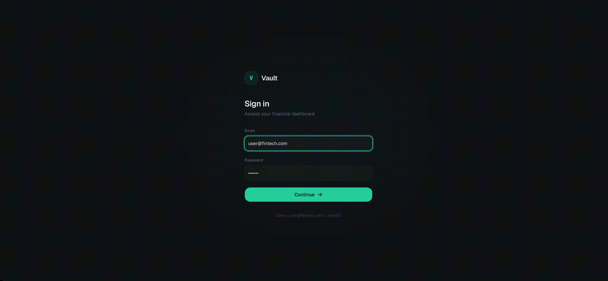

# DDD + CQRS + Event Sourcing Template

Symfony 7 / PHP 8.3 project template with DDD, CQRS, Event Sourcing, and Hexagonal Architecture.

## Quick Start

```bash
make setup
```

## Demo



## Frontend

```bash
cd frontend
npm install
npm run dev
```

Open http://localhost:3000 — login with `user@fintech.com` / `user123`.

Backend must be running first (`make setup`).

## URLs

| Service | URL |
|---------|-----|
| Frontend | http://localhost:3000 |
| API | http://localhost:8028 |
| Swagger UI | http://localhost:8028/api/docs |
| Adminer | http://localhost:8080 |
| Mailpit | http://localhost:8025 |

## Credentials

**Adminer (Database)**

| Field | Value |
|-------|-------|
| System | MySQL |
| Server | mysql |
| Username | fintech_user |
| Password | fintech_pass |
| Database | fintech_db |

**Demo Users** (after `make fixtures`):

| Role | Email | Password |
|------|-------|----------|
| Admin | admin@fintech.com | admin123 |
| User | user@fintech.com | user123 |
| User | another@fintech.com | another123 |

## Documentation

- [Architecture overview](docs/ARCHITECTURE.md)
- [Docker setup](DOCKER.md) / [Quick start](DOCKER_QUICKSTART.md)
- [API testing guide](API_TESTING.md)
- [Changelog](CHANGELOG.md)
